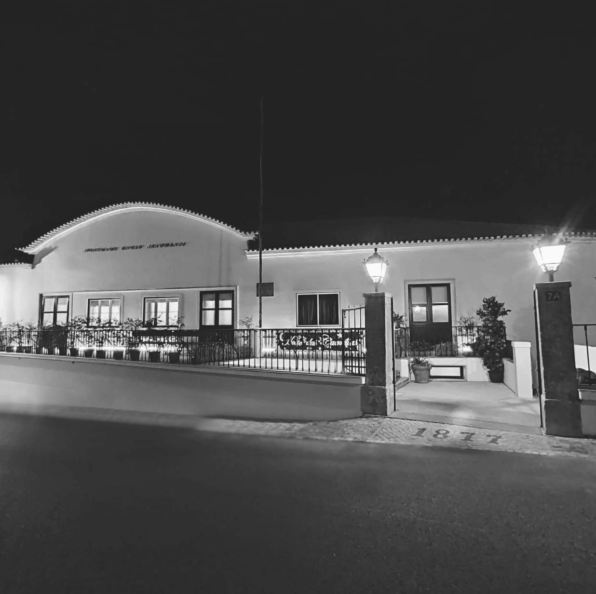
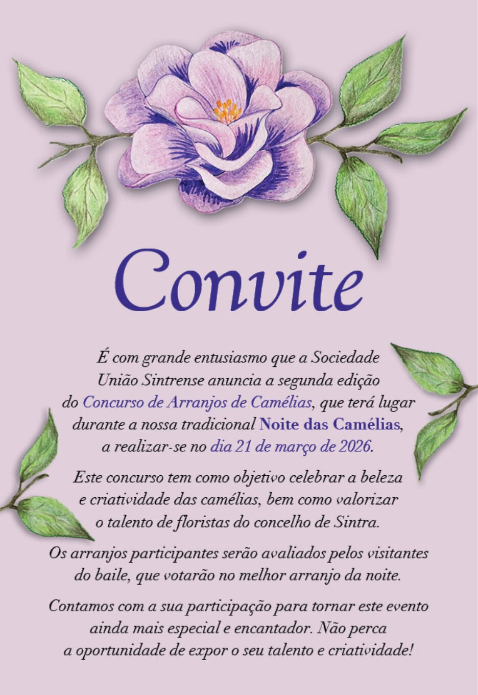

## Uma Coletividade para a Comunidade

No coração da Vila de Sintra, a Sociedade União Sintrense é, desde há gerações, um espaço de encontro, cultura e partilha. Mais do que um edifício histórico, é uma casa viva onde a tradição se cruza com a criatividade, e onde a comunidade encontra palco para se expressar.

Ao longo do tempo, a União Sintrense tem acolhido bailes, concertos, teatro, exposições, tertúlias e iniciativas sociais que fazem parte da memória coletiva de Sintra. Aqui celebram-se as artes, o convívio e o espírito associativo que continua a unir diferentes gerações, num ambiente aberto, inclusivo e de respeito mútuo.

Aberta à vila, a quem a visita e a todas as pessoas sem distinção, a Sociedade União Sintrense assume-se como um espaço seguro, acolhedor e plural, onde a diversidade é valorizada e cada pessoa é convidada a participar, criar e pertencer.

Fiel às suas raízes, mas atenta ao presente e ao futuro, a União Sintrense continua a afirmar-se como um polo cultural em constante renovação. Um lugar onde a história continua a ser escrita — sempre com Sintra como inspiração e as pessoas no centro.

***

## Donativos

O envio de donativos por parte dos sócios pode ser efetuado presencialmente ou por transferência bancária:

Nome: SOCIEDADE UNIÃO SINTRENSE

IBAN: PT50 0036 0050 99100010730 69

BIC/SWIFT: MPIOPTPL

O seu donativo reverte integralmente a favor da cultura em Sintra! 

[Email para envio de comprovativo](mailto:sociedadeuniaosintrense@gmail.com)

***

## Noite das Camélias

A Noite das Camélias é, desde 1940, uma das noites de gala mais emblemáticas de Sintra.

### Concurso de Arranjos de Camélias 2026

[Contrato](downloads/2026_cam_contr.pdf) | [Ficha de Inscrição](downloads/2026_cam_inscr.pdf) | [Email para envio](mailto:sociedadeuniaosintrense@gmail.com)

## Teatro União

O Teatro União é o espaço cénico da Sociedade União Sintrense, dedicado à criação, apresentação e partilha das artes performativas. Com uma forte ligação à vida cultural de Sintra, acolhe espetáculos, ensaios e projetos que cruzam tradição e contemporaneidade.

Aberto à comunidade e a todas as pessoas, o Teatro União é um espaço seguro, inclusivo e acolhedor, onde a liberdade criativa, o respeito e o encontro entre artistas e público estão sempre no centro.

[Saiba Mais sobre o TU]()

***
